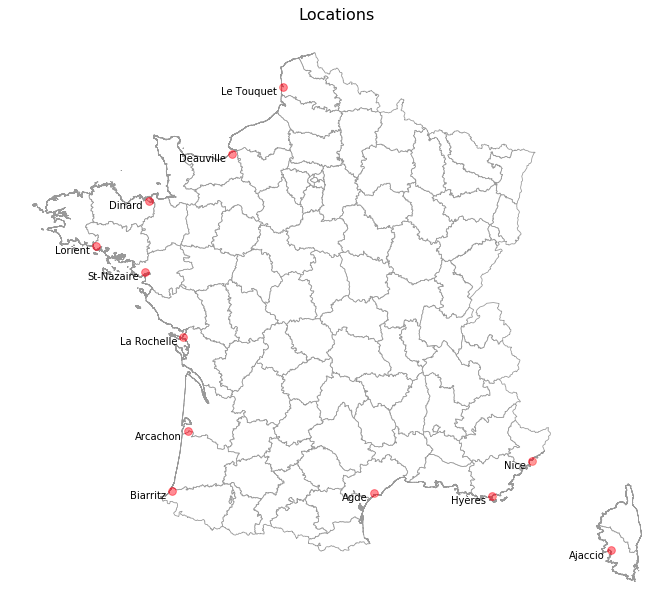
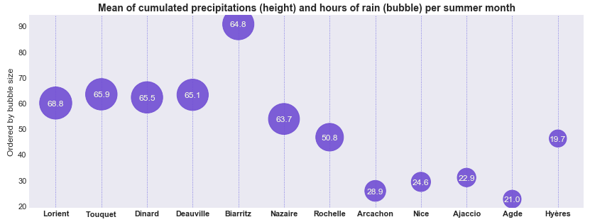
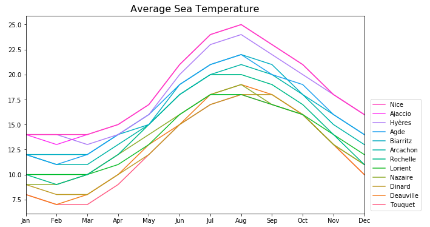

# Meteo_DataViz_Python
Analyzing and representing meteorological variables in famous towns along the French coast, over the past 6 years.

Historical data comes from meteorological stations in French coastal airports part of the METAR network (see notebook for more details).

I started with a simple notebook, with static and animated graphs (see examples below).

Next step would be to try to build more animations and potentially wrap them up into a small Dash app.

---

Interesting graphs include:

  

  
**Sea Surface Temperature over the year - 3D animated graph**

